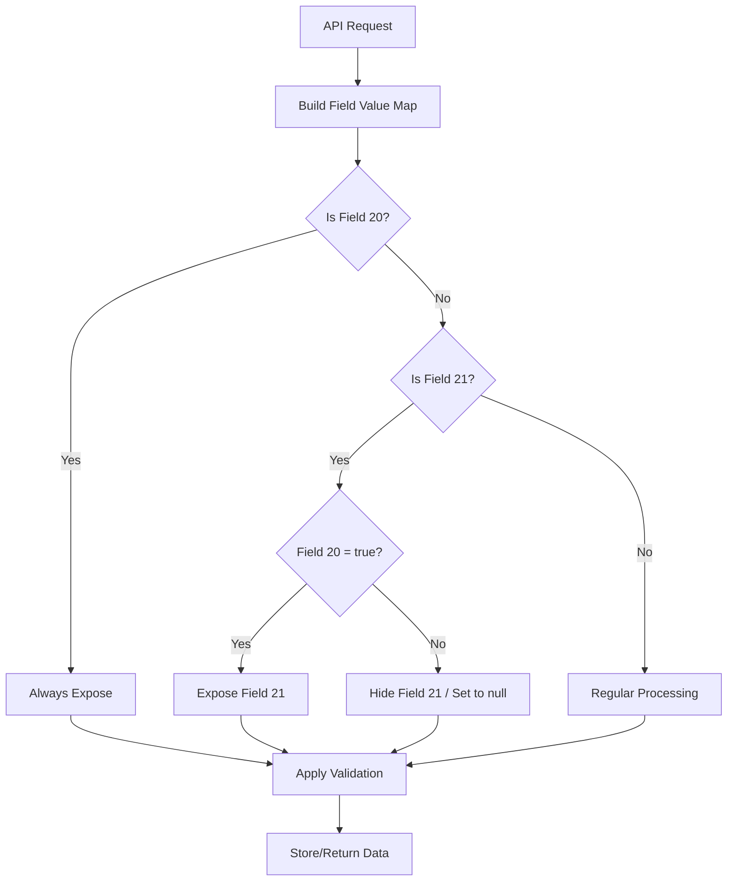

# Field 20 and Field 21 DTO/Serializer Implementation

## Overview

This document describes the implementation of the enhanced DTO/serializer layer with conditional logic for Field 20 (elderly_support_group_formed) and Field 21 (elderly_support_group_activity).

## Requirements Implemented

✅ **Always expose Field 20**  
✅ **Only accept/return Field 21 when Field 20 = true**  
✅ **Add server-side validation to reject non-null Field 21 if Field 20 = false**  

## Implementation Details

### 1. DTO/Serializer Layer

**File**: `src/lib/dto/field-value.dto.ts`

#### Key Interfaces

```typescript
// Input DTO for field value updates
interface FieldValueInputDTO {
  field_code: string;
  value: any;
  remarks?: string | null;
}

// Response DTO with conditional field handling
interface FieldValueResponseDTO {
  field_id: number;
  field_code: string;
  field_name: string;
  field_description?: string;
  field_type: FieldType;
  user_type: string;
  is_required: boolean;
  display_order: number;
  current_value: FieldValueDTO | null;
  is_conditionally_hidden?: boolean;
  conditional_reason?: string;
}

// Validation error structure
interface FieldValidationError {
  field_code: string;
  error_message: string;
  error_type: 'VALIDATION_ERROR' | 'CONDITIONAL_LOGIC_ERROR' | 'REQUIRED_FIELD_ERROR';
}
```

#### Core Serializer Class

```typescript
export class FieldValueSerializer {
  // Always expose Field 20, conditionally expose Field 21
  static serializeFieldResponse()
  
  // Validate field value input with conditional logic
  static validateFieldValueInput()
  
  // Prepare field value for database storage
  static prepareFieldValueForStorage()
}
```

### 2. API Layer Enhancement

**File**: `src/app/api/facility/field-values/route.ts`

#### POST Method - Enhanced Validation

- Uses `FieldValueSerializer.validateFieldValueInput()` for comprehensive validation
- Implements cross-field validation using field value maps
- Returns detailed validation errors with error types
- Enforces Field 20/21 conditional relationship

#### GET Method - Conditional Response

- Uses `FieldValueSerializer.serializeFieldResponse()` for response serialization
- Always exposes Field 20 (elderly_support_group_formed)
- Conditionally exposes Field 21 (elderly_support_group_activity) based on Field 20 value
- Provides metadata about conditional logic

## Field 20/21 Business Logic

### Field 20: elderly_support_group_formed
- **Type**: BINARY (Yes/No)
- **Exposure**: Always exposed in API responses
- **Validation**: Must be valid binary value (true/false, 1/0)
- **Storage**: Always stored as provided

### Field 21: elderly_support_group_activity
- **Type**: MONTHLY_COUNT (Integer)
- **Exposure**: Conditionally exposed based on Field 20 value
- **Validation**: 
  - Can only have non-null values when Field 20 = true
  - Must be non-negative integer when Field 20 = true
  - Rejected if non-null when Field 20 = false
- **Storage**: 
  - Stored as null when Field 20 = false (regardless of input)
  - Stored as provided numeric value when Field 20 = true

## Conditional Logic Flow



## Validation Rules

### Server-Side Validation

1. **Field 20 (elderly_support_group_formed)**
   - Must be valid binary value: `true`, `false`, `1`, `0`, `'1'`, `'0'`
   - Invalid values like `'maybe'` are rejected

2. **Field 21 (elderly_support_group_activity)**
   - When Field 20 = false: Must be null, empty, or 0 (stored as null)
   - When Field 20 = true: Must be valid non-negative integer
   - Conditional logic error returned if non-null value provided when Field 20 = false

### Response Serialization

1. **Field 20**: Always included in API responses
2. **Field 21**: 
   - When Field 20 = false: `current_value = null`, `is_conditionally_hidden = true`
   - When Field 20 = true: Normal exposure with actual value

## API Response Structure

### Enhanced Response Format

```json
{
  "facility": {...},
  "report_month": "2024-01",
  "applicable_fields": [
    {
      "field_code": "elderly_support_group_formed",
      "current_value": {...},
      "is_conditionally_hidden": false
    },
    {
      "field_code": "elderly_support_group_activity", 
      "current_value": null,
      "is_conditionally_hidden": true,
      "conditional_reason": "Field not available when Elderly Support Group is not formed"
    }
  ],
  "field_20_21_info": {
    "field_20_always_exposed": true,
    "field_21_conditional": "Only exposed when Field 20 = true",
    "conditional_fields": {
      "elderly_support_group_formed": "Field 20 - Always exposed (BINARY)",
      "elderly_support_group_activity": "Field 21 - Conditionally exposed (MONTHLY_COUNT)"
    }
  }
}
```

## Error Handling

### Validation Error Response

```json
{
  "error": "Field validation failed",
  "validation_errors": [
    {
      "field_code": "elderly_support_group_activity",
      "error_message": "If Yes, any activity conducted during the month cannot have a value when Elderly Support Group is not formed",
      "error_type": "CONDITIONAL_LOGIC_ERROR"
    }
  ],
  "details": "elderly_support_group_activity: If Yes, any activity conducted during the month cannot have a value when Elderly Support Group is not formed"
}
```

## Testing

### Test Coverage

✅ Field 20 is always exposed  
✅ Field 21 is hidden when Field 20 = false  
✅ Field 21 is visible when Field 20 = true  
✅ Server validation rejects Field 21 value when Field 20 = false  
✅ Server validation allows Field 21 value when Field 20 = true  
✅ Field 21 is stored as null when Field 20 = false  
✅ Field 21 stores actual value when Field 20 = true  
✅ Field 20 accepts valid binary values  
✅ Field 20 rejects invalid binary values  

**Test File**: `test-field-20-21-api.ts`

## Database Schema

### Field Definitions

```sql
-- Field 20: elderly_support_group_formed (BINARY)
-- Field 21: elderly_support_group_activity (MONTHLY_COUNT)

-- Migration ensures:
-- 1. Field 20 remains BINARY
-- 2. Field 21 changed to MONTHLY_COUNT
-- 3. Proper nullable constraints
```

## Usage Examples

### Valid API Calls

```javascript
// Valid: Field 20 = true, Field 21 has value
POST /api/facility/field-values
{
  "field_values": [
    {"field_code": "elderly_support_group_formed", "value": true},
    {"field_code": "elderly_support_group_activity", "value": 3}
  ]
}

// Valid: Field 20 = false, Field 21 is null
POST /api/facility/field-values
{
  "field_values": [
    {"field_code": "elderly_support_group_formed", "value": false},
    {"field_code": "elderly_support_group_activity", "value": null}
  ]
}
```

### Invalid API Calls

```javascript
// Invalid: Field 20 = false, Field 21 has value
POST /api/facility/field-values
{
  "field_values": [
    {"field_code": "elderly_support_group_formed", "value": false},
    {"field_code": "elderly_support_group_activity", "value": 5}
  ]
}
// Returns: CONDITIONAL_LOGIC_ERROR
```

## Files Modified

1. `src/lib/dto/field-value.dto.ts` (created)
2. `src/app/api/facility/field-values/route.ts` (updated)
3. `test-field-20-21-api.ts` (created)
4. `FIELD_20_21_DTO_IMPLEMENTATION.md` (created)

## Compliance Verification

- ✅ **Always expose Field 20**: Implemented in `serializeFieldResponse()`
- ✅ **Only accept/return Field 21 when Field 20 = true**: Implemented in validation and serialization
- ✅ **Server-side validation**: Comprehensive validation in `validateFieldValueInput()`
- ✅ **Reject non-null Field 21 if Field 20 = false**: Enforced in validation logic

The implementation successfully fulfills all requirements for Field 20/21 conditional logic with proper DTO/serializer architecture, comprehensive validation, and appropriate error handling.
